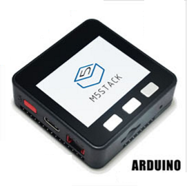

***********
Get Started
***********

This document is intended to help users set up the software environment for development of applications. Through a simple example we would like to illustrate how to develop M5Stack boards, firmware(`Arduino IDE`) or source files(`Micropython`) download to M5Stack boards. 

Introduction
============

(add introduction of hardware source on M5Stack Core)

What You Need
=============

To develop applications for M5Stack Core you need:

* **PC** loaded with either Windows, Linux or Mac operating system
* a **M5Stack Core** with Type-C cable
 
Preparation of development environment consists of three steps:

1. Setup of **Toolchain**
2. Getting of **ESP-IDF** from GitHub

1. Configuration
2. 

See instructions below that will walk you through these steps.

Your boards
============

If you have one of ESP32 development boards listed below, click on provided links to get you up and running.

============================  ============================  ============================
|Core Arduino|_                |Core Micropython|_           |M5GO|_
----------------------------  ----------------------------  ----------------------------
`Core Arduino`_                `Core Micropython`_           `M5GO`_
----------------------------  ----------------------------  ----------------------------
|ESP32CAM|_                    |M5Stack STEPMOTOR Module|_   |M5Stand|_
----------------------------  ----------------------------  ----------------------------
`ESP32CAM`_                    `M5Stack STEPMOTOR Module`_   `M5Stand`_
============================  ============================  ============================

.. _Core Arduino: get-started-M5StackCore-Arduino.html

.. _Core Micropython: get-started-M5StackCore-Micropython.html

.. _M5GO: index.html

.. _ESP32CAM: index.html

.. _M5Stack STEPMOTOR Module: index.html

.. _M5Stand: index.html

.. toctree::
    :maxdepth: 1
    :hidden:

    M5Stack Core with Arduino IDE <get-started-M5StackCore-Arduino>
    M5Stack Core with Micropython <get-started-M5StackCore-Micropython>
    M5GO <get-started-M5StackCore-Arduino>
    ESP32CAM <get-started-M5StackCore-Arduino>
    M5Stack STEPMOTOR Module <get-started-M5StackCore-Arduino>
    M5Stand<get-started-M5StackCore-Arduino>
    
    
    

If you have different board, move to sections below.

Related Documents
=================

.. toctree::
    :maxdepth: 1

    add-idf_path-to-profile
    establish-serial-connection

